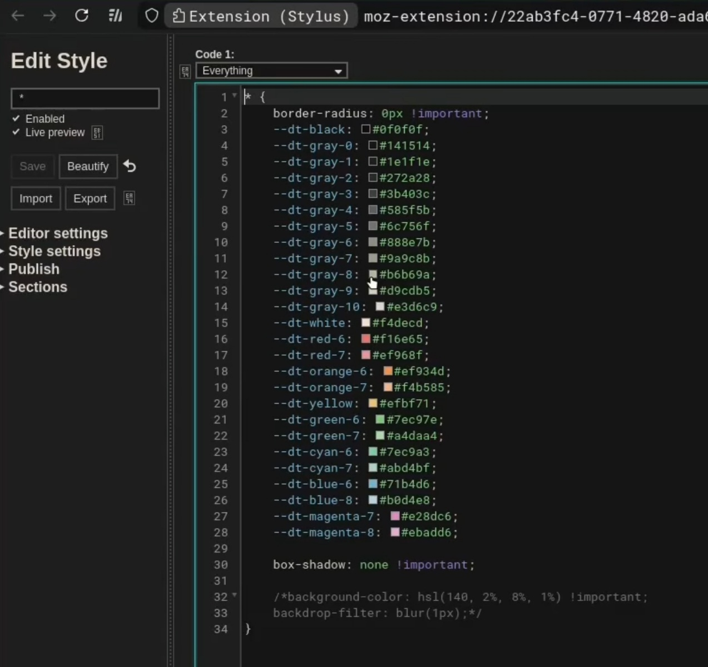

# Mi3
My minimal Archlinux i3 dotfiles for me to recover my bare system anytime later

Should work on any distro as long as all the packages in [pkglist.txt](./pkglist.txt) and [aur-pkglist.txt](./aur-pkglist.txt) are installed properly

Feel free to edit stuff or copy it as you need.

Made on my potato laptop to make it work faster as I had more important stuff on desktop

Its minimal uses like 300 mb on idle.

Minimal black & white theme


##  Notes

- Mod key = Super (Windows key)
- Uses tiling workflow with floating support
- Wallpaper set via feh
- Compositor: picom
- Notifications: dunst

## Requirements
Archlinux minimal installed(either via archinstall script or mannual), yay installed, all graphics drivers, bluetooth, touchpad(for laptop), wifi setted up.

### Install yay (AUR helper)
```bash
sudo pacman -S --needed git base-devel
git clone https://aur.archlinux.org/yay.git
cd yay
makepkg -si
cd ..
rm -rf yay
```
## Auto Installation (Not recommended)
this install is only recommended for Archlinux minimal fresh installed systems.
Always read scripts before running blindly!
1. clone the repo at ~/
```bash
cd ~
sudo pacman -S git
git clone https://github.com/notmish/Mi3.git
```
2. cd into the directory and give auto-install.sh permission
```bash
cd ~/Mi3
chmod +x auto-install.sh
```
3. Run the script
```bash
cd ~/Mi3
./auto-install.sh
```

Follow through all the steps.
Reboot and and select i3 from sddm or your preferred login manager.

## Mannual Installation 
Clone the repo
```bash
cd ~
git clone https://github.com/notmish/Mi3.git
```
### 1.
cd into the the newly cloned folder ~/Mi3 (DO NOT GO OUT OF THIS BEFORE FINISHING THIS MANNUAL SETUP)
```bash
cd ~/Mi3
```
### 2.
copy all the files inside (in case folders dosent exists then create them!) .config to your ~/.config
```bash
cp -r ~/Mi3/.config/* ~/.config/
```
move .fehbg to ~/
```bash
mv ~/Mi3/.fehbg ~/
```
move .local to ~/
```bash
mv ~/Mi3/.local/* ~/.local/
```
move Pictures to ~/
```bash
mv ~/Mi3/Pictures ~/
```
move .bashrc to ~/
```bash
mv ~/.bashrc ~/.bashrc.backup
cp ~/Mi3/.bashrc ~/.bashrc
```
move picom.conf to /etc/xdg/
```bash
sudo mv ~/Mi3/picom.conf /etc/xdg/
```
if youre on virtual machine make sure to turn off vsync on picom.conf else picom wont work.

move .Xresources to ~/
```bash
mv ~/Mi3/.Xresources ~/
```

### 3.
install the pacman and yay packages.
   for pacman
```bash
cd ~/Mi3
sudo pacman -S --needed - < pkglist.txt
```
  for yay
```bash
cd ~/Mi3
yay -S --needed - < aur-pkglist.txt
```
### 4.
make all the executables executable for useage(use sudo if shows error)
fehbg for wallpaper
```bash
chmod +x ~/.fehbg
```
two of the screenshot scripts (use sudo if gets error)
```bash
cd ~/.local/bin
chmod +x screenshot-select.sh screenshot.sh
```
## Extra
for laptops you need to go into ~/.config/i3status/i3status.conf and remove "#" from "#order += "battery all""

## SDDM
I use sddm so I dont have xinit or stuff. 
To enable sddm use 
(do it at the last of Installation)
```bash
sudo systemctl enable sddm
```

Now reboot the system.
after rebooting start i3 session and from lxappearance select Materia-dark on widget, Papirus-Dark on icon and Bibata-Modern-Ice on mouse cursor.
do this for proper mouse cursor view:
```bash
xrdb ~/.Xresources
```
### There's a tmp file inside .local named deleteme.jpg. kindly delete that.

# ⌨️ i3 Keybindings (Mod4 = Super key)

This is a custom configuration for i3 window manager.

---

##  Core Apps

- Terminal: `Mod + Enter`
- File Manager: `Mod + F`
- Browser: `Mod + B`
- Close Window: `Mod + Q`
- App Launcher (rofi): `Mod + D`

---

##  Focus Windows

- Left: `Mod + J` or `Mod + Left`
- Down: `Mod + K` or `Mod + Down`
- Right: `Mod + ;` or `Mod + Right`
- Up: `Mod + Up`

---

##  Move Windows

- Left: `Mod + Shift + J`
- Down: `Mod + Shift + K`
- Up: `Mod + Shift + L`
- Right: `Mod + Shift + ;`

(Arrow keys also work with Shift)

---

##  Layout Controls

- Split Horizontal: `Mod + H`
- Split Vertical: `Mod + V`
- Fullscreen: `Mod + Shift + F`
- Toggle Floating: `Mod + Shift + Space`
- Toggle Focus Floating/Tiling: `Mod + Space`
- Stacking Layout: `Mod + S`
- Tabbed Layout: `Mod + W`
- Toggle Split: `Mod + E`
- Focus Parent: `Mod + A`

---

##  Workspaces

- Switch workspace 1–10: `Mod + 1 ... Mod + 0`
- Move window to workspace: `Mod + Shift + 1 ... Mod + Shift + 0`

---

##  System Controls

- Reload config: `Mod + Shift + C`
- Restart i3: `Mod + Shift + R`
- Exit i3: `Mod + Shift + E`

---

##  Volume Controls

- Volume Up: `Mod + Alt + Right`
- Volume Down: `Mod + Alt + Left`
- Mute: `Mod + Alt + M`
- Mic Mute: `XF86AudioMicMute`

---

##  Brightness

- Increase: `Mod + Alt + Up`
- Decrease: `Mod + Alt + Down`

---

##  Screenshots

- Fullscreen: `Mod + Print`
- Area Select: `Mod + Shift + Print`

Scripts:
- `~/.local/bin/screenshot.sh`
- `~/.local/bin/screenshot-select.sh`

---

##  Utilities

- Notification history: `Mod + N`
- Lock screen: `Mod + L`
- To change wallpaper go to the bottom of i3 config and find wallpaper section. there are indication to change the image path which is going to be the wallpaper. to see the wallpaper exit i3 and renter or just reload.

---
## Browser (optional)
theres a config code(copied from dacctal) for Stylus plugin. select Applies to > Everything and and aslo type * inside the box under Edit style of left top, then paste the code inside Code section. It makes everything square.

Turn off Auto delete history from settings in librewolf browser. Its a hardened privacy focused browser so if u find any problem just google it and you will find fix.
Or simply just check all the settings and turn on and off features 

### Finally delete the Mi3 directory. you don't need that.
