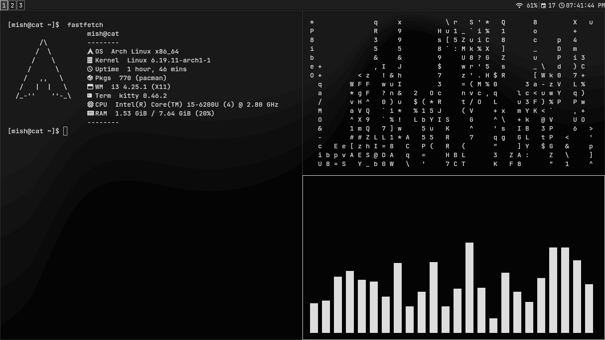

# Mi3
my minimal Archlinux i3 dotfiles for me to recover my bare system anytime later

feel free to edit stuff or copy it as you need.

made on my potato laptop to make it work faster as I had more important stuff on desktop

Its minimal uses like 300 mb on idle
Its a minimal black & white theme


## Requirements
Archlinux minimal installed(either via archinstalled script or mannual), yay installed, all graphics drivers, bluetooth, touchpad(for laptop),wifi setted up.
I use sddm so I dont have xinit or stuff. 
To enable sddm use (do it at the last of Installation)
```bash
sudo systemctl enable sddm
```
### Install yay (AUR helper)
```bash
sudo pacman -S --needed git base-devel
git clone https://aur.archlinux.org/yay.git
cd yay
makepkg -si
cd ..
rm -rf yay
```

## Installation 
Clone the repo
```bash
cd ~
git clone https://github.com/notmish/Mi3.git
```
1. cd into the the newly cloned folder ~/Mi3 (DO NOT GO OUT OF THIS BEFORE FINISHING THIS MANNUAL SETUP)
2. copy all the files inside (in case folders dosent exists then create them!) .config to your ~/.config
```bash
cp -r ~/Mi3/.config/* ~/.config/
```
move .fehbg to ~/
```bash
mv ~/Mi3/.fehbg ~/
```
move .local to ~/
```bash
mv ~/Mi3/.local/* ~/.local/
```
move Pictures to ~/
```bash
mv ~/Mi3/Pictures ~/
```
move .bashrc to ~/
```bash
mv~/.bashrc ~/.bashrc.backup
cp ~/Mi3/.bashrc ~/.bashrc
```
move picom.conf to /etc/xdg/
```bash
sudo mv ~/Mi3/picom.conf /etc/xdg/
```

3. install the pacman and yay packages.
   for pacman
```bash
cd ~/Mi3
sudo pacman -S --needed - < pkglist.txt
```
  for yay
```bash
cd ~/Mi3
yay -S --needed - < aur-pkglist.txt
```
4. make all the executables executable for useage(use sudo if shows error)
fehbg for wallpaper
```bash
chmod +x ~/.fehbg
```
two of the screenshot scripts (use sudo if gets error)
```bash
cd ~/.local/bin
chmod +x screenshot-select.sh screenshot.sh
```
Now reboot the system.
after rebooting start i3 session and from lxappearance select Materia-dark on widget, Papirus-Dark on icon and Bibata-Modern-Ice on mouse cursor.
### There's three tmp files inside .local, Pictures and Pictures/screenshot. kindly delete them. If i do my files gets messed up on github
## REBOOT
